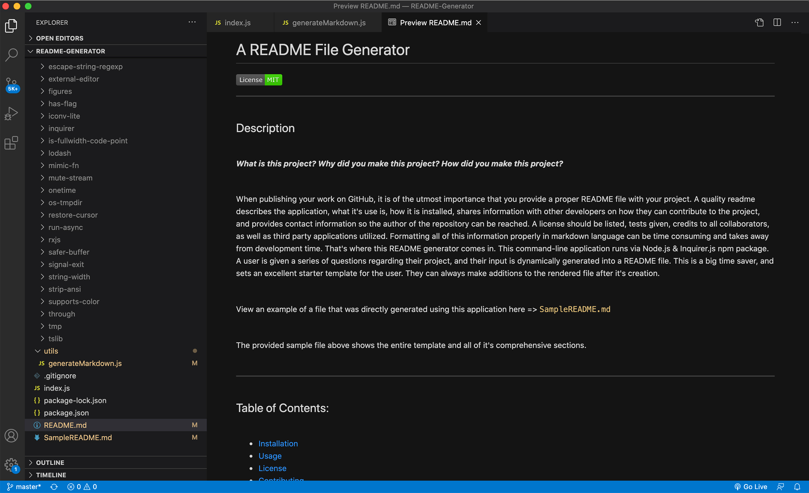

# A README File Generator‏‏‎
‎‎ 
  

  ---
  
  
&nbsp;

    

## Description 

&nbsp;

<strong><em>What is this project? Why did you make this project? How did you make this project?</strong></em>

&nbsp;

When publishing your work on GitHub, it is of the utmost importance that you provide a proper README file with your project. A quality README describes the application, what it's use is, how it is installed, shares information with other developers on how they can contribute to the project, and provides contact information so the author of the repository can be reached. A license should be listed, tests given, credits to all collaborators, as well as third party applications utilized. Formatting all of this information properly in markdown language can be time consuming and takes away from development time. That's where this README generator comes in. This command-line application runs via Node.js & Inquirer.js npm package. A user is given a series of questions regarding their project, and their input is dynamically generated into a README file. This is a big time saver, and sets an excellent starter template for the user. They can always make additions and/or reductions to the rendered file after it's creation. The user is also asked for their email and github username, and links are generated within the file for both.

&nbsp;

The README you are viewing currently is relevant to the project itself, and does display not the entirety of this applications render potential. View a file with all of the offered sections included here => [`SampleREADME.md`](https://github.com/jonathanschimpf/README-Generator/blob/master/SampleREADME.md)

&nbsp;

---

&nbsp;

## Table of Contents: 

&nbsp;

* [Installation](#installation)
* [Usage](#usage)
* [License](#license)
* [Credits](#credits)
* [Questions](#questions)

&nbsp;

---

&nbsp;

## Installation

&nbsp;

<strong><em>What are the steps required to install this project?</strong></em>

&nbsp;

To make use of this application, you must first run `npm install` within the terminal to begin the install of inquirer.

&nbsp;

Once set up with the dependencies, begin the series of questioning for your README by running `node index.js`.

&nbsp;

---

&nbsp;

## Usage

&nbsp;

<strong><em>Instructions and examples for usage:</strong></em>

&nbsp;

Answer a series of questions about your project to generate your markdown file. 

&nbsp;

These prompts are possible via the `inquirer` package.

&nbsp;

View a video overview on usage here:

&nbsp;

 

&nbsp;

---

&nbsp;

&nbsp;

---

&nbsp;

## License

&nbsp;

This project is covered under the MIT license. 

&nbsp;

---

&nbsp;

## Credits

&nbsp;

<strong><em>Third party assets:</strong></em>

&nbsp;

`Node.js` => [ An asynchronous event-driven runtime built on Chrome's V8 JavaScript engine.](https://nodejs.org/en/)

&nbsp;‏‏‎‏‏‎ ‎<strong>+</strong>

`inquirer npm` => [A beautiful collection of common interactive command line user interfaces.](https://www.npmjs.com/package/inquirer)

&nbsp;

---

&nbsp;

## Questions?

&nbsp;

Shoot me an e-mail! => jonathan@jonathanschimpf.com

&nbsp;

Check out more of my work here on =>
[GitHub](http://github.com/jonathanschimpf)

&nbsp;

